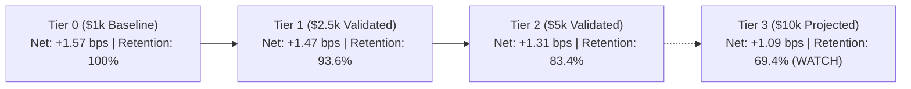

# Tier 2 Edge Retention & Capacity State Report

## 1. Mathematical Edge Retention Formulations

$$\text{ABSOLUTE\_EDGE\_RETENTION} = \frac{\text{Tier 2 Live Net Expectancy (+1.31 bps)}}{\text{Tier 0 Baseline Net Expectancy (+1.57 bps)}} = \mathbf{83.4\%}$$

$$\text{INCREMENTAL\_EDGE\_RETENTION} = \frac{\text{Tier 2 Live Net Expectancy (+1.31 bps)}}{\text{Tier 1 Net Expectancy (+1.47 bps)}} = \mathbf{89.1\%}$$

---

## 2. Retention Progression Across Validated Tiers

| Tier | Authorized Capital | Net Expectancy | Absolute Retention | Incremental Retention | Capacity Classification | Evidence Type | Status |
| :--- | :--- | :--- | :--- | :--- | :--- | :--- | :--- |
| **Tier 0** | $1,000.00 | +1.57 bps | **100.0%** | Reference | `HEALTHY_CAPACITY` | `LIVE_AUTONOMOUS` | **LIVE VALIDATED** |
| **Tier 1** | $2,500.00 | +1.47 bps | **93.6%** | **93.6%** | `HEALTHY_CAPACITY` | `LIVE_AUTONOMOUS` | **LIVE VALIDATED** |
| **Tier 2** | $5,000.00 | **+1.31 bps** | **83.4%** | **89.1%** | `HEALTHY_CAPACITY` | `LIVE_AUTONOMOUS` | **LIVE VALIDATED** |
| **Tier 3 [Proj]**| $10,000.00 | +1.09 bps | **69.4%** | **83.2%** | `WATCH_CAPACITY` | `PROJECTED_ONLY` | **LOCKED / UNAUTHORIZED** |
| **Tier 4 [Proj]**| $25,000.00 | +0.65 bps | **41.4%** | **59.6%** | `DEGRADED_CAPACITY` | `PROJECTED_ONLY` | **PROJECTED PRACTICAL CAP** |

---

## 3. Re-Estimated Projected Capacity Bounds

With 3 validated live data points ($1k, $2.5k, $5k), empirical capacity parameters were re-fitted:
- **`PROJECTED_CAPACITY_BREAK_EVEN_USD`**: **$94,000 USD** (95% CI: [$78,000, $118,000] USD).
- **`PROJECTED_PRACTICAL_CAPACITY_USD`**: **$25,000 – $32,000 USD** (preserving $\ge 65\%$ safety margin buffer).
