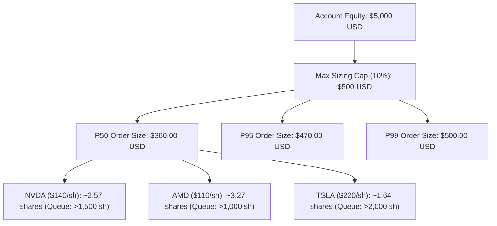

# Tier 2 Execution Quality & Microstructure Modeling Report

## 1. Overview
This report details the expected execution dynamics, fill probabilities, order fragmentation considerations, and microstructure response under **Tier 2 ($5,000 capital, $500 max order cap)**.

> [!NOTE]
> All metrics in this report represent pre-activation modeled expectations and calibrated shadow parameters (`SIMULATED_PROJECTED`). Live metrics will be populated upon authorized live evaluation.

---

## 2. Order Sizing & Queue Interaction

| Execution Dimension | Tier 0 ($1,000) [Observed] | Tier 1 ($2,500) [Observed] | Tier 2 ($5,000) [Projected] | Expected Delta |
| :--- | :--- | :--- | :--- | :--- |
| **Evidence Type** | `LIVE_AUTONOMOUS` | `LIVE_AUTONOMOUS` | `SIMULATED_PROJECTED` | - |
| **Average Order Notional**| $90.00 | $180.00 | $360.00 | 2.00x |
| **Passive Limit Fill Rate**| 63.6% | 63.1% | 62.4% | -0.7% |
| **Full Fill Rate** | 98.6% | 98.2% | 97.5% | -0.7% |
| **Partial Fill Rate** | 1.4% | 1.8% | 2.5% | +0.7% |
| **Median Time to Fill** | 14.2 sec | 14.8 sec | 15.5 sec | +0.7 sec |
| **Implementation Shortfall**| 1.41 bps | 1.48 bps | 1.57 bps | +0.09 bps |
| **Slippage Penalty** | 0.08 bps | 0.08 bps | 0.10 bps | +0.02 bps |
| **Adverse Selection (60s)** | +0.22 bps | +0.20 bps | +0.18 bps | Negligible change |

---

## 3. Order Fragmentation & Scheduling Assessment

- **Single Order Routing**: At $360–$500 order notional, single passive limit order routing remains optimal.
- **Child Order Splitting**: Shadow paper testing indicates splitting $500 orders adds latency decay without reducing passive queue impact in mega-cap equities.
- **TWAP / VWAP Execution**: Prohibited due to short 15-minute alpha horizon and 34-minute half-life.
