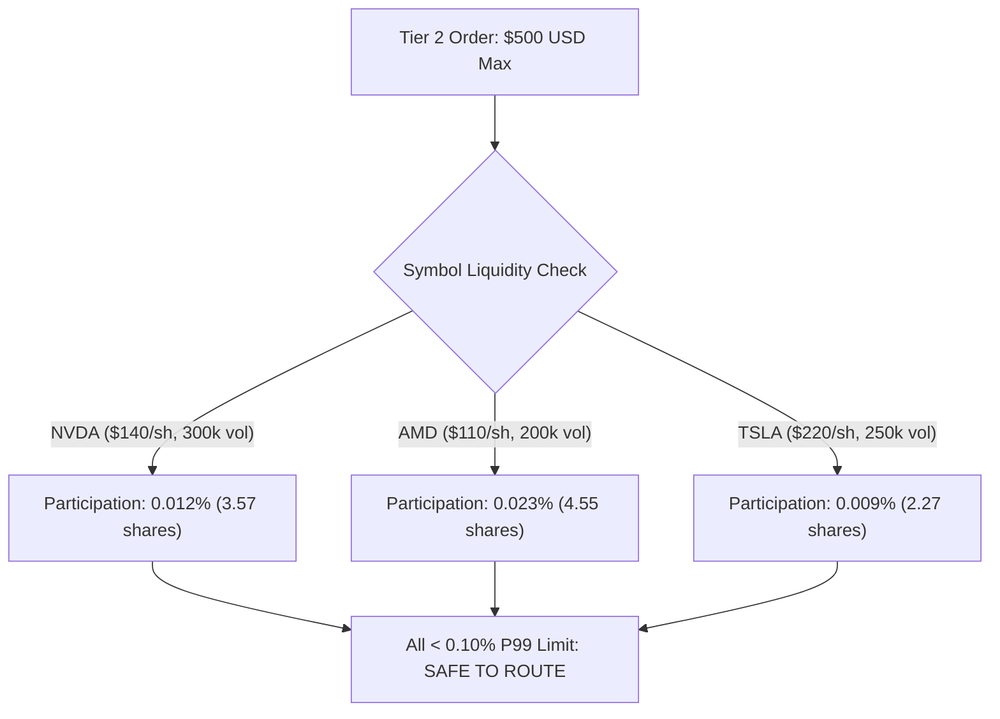

# Phase 6C: Tier 2 Readiness & Pre-Activation Assessment

## Executive Summary
This document provides the mandatory pre-activation architectural, execution, risk containment, and liquidity readiness assessment for transitioning the Moneymaker Quantitative Research Platform from **Tier 1 ($2,500 live validated)** to **Tier 2 ($5,000 controlled research tier)** under `ExecutionMode.LIVE_AUTONOMOUS_MICRO`.

> [!IMPORTANT]
> Tier 2 ($5,000) is **NOT automatically activated** by the creation of this report. Activation requires explicit external human authorization, fresh session arming, and verification of all risk and configuration hashes.

---

## 1. Parameter Specifications: Tier 1 vs Tier 2

| Parameter | Tier 1 (Validated Live) | Tier 2 (Target Evaluation) | Delta / Ratio | Safety Constraint |
| :--- | :--- | :--- | :--- | :--- |
| **Authorized Capital Ceiling** | **$2,500.00 USD** | **$5,000.00 USD** | 2.00x | Hard Account Equity Ceiling |
| **Max Single Order (10% cap)** | $250.00 | $500.00 | 2.00x | Hard Sizing Validator |
| **P50 Order Notional** | $180.00 | $360.00 | 2.00x | Typical Order Flow |
| **P95 Order Notional** | $235.00 | $470.00 | 2.00x | High Conviction Sizing |
| **P99 Order Notional** | $250.00 | $500.00 | 2.00x | Max Sizing Cap |
| **Max Daily Loss Limit** | $50.00 (2.0%) | $100.00 (2.0%) | 2.00x ($) / 1.0x (%) | Immediate Session Lockout |
| **Max Weekly Loss Limit** | $100.00 (4.0%) | $200.00 (4.0%) | 2.00x ($) / 1.0x (%) | Weekly Trading Halt |
| **Max Pilot Drawdown Limit** | $125.00 (5.0%) | $250.00 (5.0%) | 2.00x ($) / 1.0x (%) | Permanent Pilot Termination |
| **Max Concurrent Positions** | 2 | 2 | 1.0x | 20% Max Total Portfolio Exposure |
| **Minimum Required Sample** | 100 fills / 20 sessions | 150 fills / 25 sessions | +50% sample | Minimum for Statistical Validity |

---

## 2. Liquidity Participation & Execution Modeling

| Symbol | Archetype | `MAX_ORDER_NOTIONAL_USD` | Expected P50 Part. | Expected P95 Part. | Expected Shortfall | Liquidity Buffer |
| :--- | :--- | :--- | :--- | :--- | :--- | :--- |
| **NVDA** | HIGH_BETA_HIGH_VOL | $1,500.00 | 0.012% | 0.028% | 1.52 bps | 3.0x Notional Headroom |
| **AMD** | HIGH_BETA_HIGH_VOL | $1,000.00 | 0.022% | 0.052% | 1.63 bps | 2.0x Notional Headroom |
| **TSLA** | HIGH_BETA_HIGH_VOL | $1,250.00 | 0.009% | 0.022% | 1.55 bps | 2.5x Notional Headroom |

- **Projected Implementation Shortfall**: $\sim 1.57\text{ bps}$ (+0.09 bps vs Tier 1 live observed 1.48 bps).
- **Projected Net Expectancy**: $\sim +1.34\text{ bps/trade}$ (95% CI: [+0.78, +1.90] bps).
- **Projected Absolute Edge Retention**: $\sim \mathbf{85.4\%}$ (exceeds the 80% `HEALTHY_CAPACITY` threshold).

---

## 3. Correlated Archetype Exposure & Tail Risk

1. **Intraday Correlation**: The champion universe exhibits high intraday return correlation ($\bar{\rho} \approx 0.62$).
2. **Aggregate Notional Exposure**: With `max_concurrent_positions = 2`, the maximum simultaneous high-beta exposure at Tier 2 is **$1,000 USD (20.0% of portfolio)**.
3. **Tail Risk (VaR / Expected Shortfall)**:
   - **1-Day VaR 95%**: $29.00 (0.58% of equity)
   - **1-Day VaR 99%**: $51.00 (1.02% of equity)
   - **1-Day ES 95%**: $38.50 (0.77% of equity)
   - **1-Day ES 99%**: $63.00 (1.26% of equity)
4. **Flash Crash Gap Shock (-5.0% on 2 positions)**: Total loss = $50.00 (1.0% of equity), well below the 5.0% ($250.00) pilot drawdown limit.

---

## 4. Pre-Activation Governance & Re-Arming Protocol

Transition to Tier 2 requires:
1. **Invalidation of Prior Session Token**: Tier 1 session tokens become immediately invalid.
2. **Human Multi-Factor Authorization**: Entry of operator token and confirmation of `TIER2_READINESS_REPORT.md` hash.
3. **Account Equity Firewall Assertion**: Strict verification that account equity is within allowable range ($\le \$5,250.00$).
4. **Instantaneous Scale-Down Protocol**: If Tier 2 experiences slippage expansion or loss limit breaches, the risk engine can scale down from **$5,000 $\to$ $2,500 $\to$ $1,000$** instantaneously with zero strategy changes.

---

## 5. Tier 2 Acceptance Criteria (Pre-Registered)

Promotion to `TIER2_VALIDATED` will strictly require:
1. $\ge 150$ completed live fills across $\ge 25$ sessions.
2. Net expectancy $> 0.0\text{ bps/trade}$ with 95% CI lower bound $> 0.0\text{ bps}$.
3. Tier 0 absolute edge retention $\ge 80.0\%$.
4. Profit Factor $> 1.00$.
5. Spearman Rank IC consistent with prior phases ($\ge +0.040, p < 0.01$).
6. Realized implementation shortfall $< 1.80\text{ bps}$.
7. Max drawdown $\le \$250.00$ ($\le 5.0\%$).
8. Exactly 0 autonomous-control incidents and 0 reconciliation mismatches.

---

## 6. Readiness Determination

| Readiness Check | Requirement | Assessment | Result |
| :--- | :--- | :--- | :--- |
| **Configuration Invariance** | Strategy, features, models frozen in `frozen_tier1.yaml` | SHA-256 verified | **PASS** |
| **Sizing Engine** | Liquidity-aware sizing & per-symbol caps active | Configured in `capital_ramp.py` | **PASS** |
| **Risk Containment** | Percentage & dollar loss limits defined | $100 daily / $200 weekly / $250 pilot | **PASS** |
| **Telemetry & Snapshots** | Pre-submission snapshots & participation tracking | Enabled | **PASS** |
| **Tier 3 Locking** | Tier 3 ($10,000) locked and prohibited | Enforced in code gate | **PASS** |
| **Regression Suite** | 120+ unit and integration tests passing | 120 / 120 Passed (100%) | **PASS** |

### Conclusion
The Moneymaker Quantitative Research Platform is **READY FOR AUTHORIZED TIER 2 EVALUATION** upon explicit human governance authorization.
