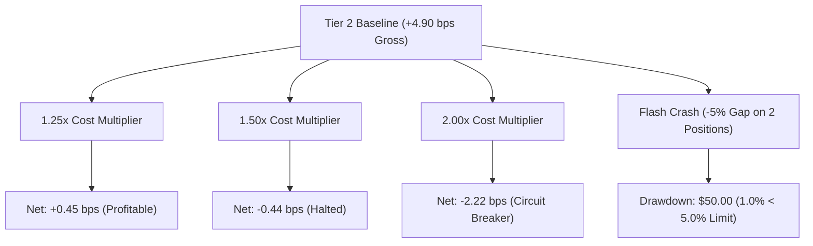

# Tier 2 Risk Architecture, Loss Budgets & Stress Testing Report

## 1. Overview
This report specifies the conservative risk parameters, loss budgets, tail-risk metrics (VaR / Expected Shortfall), and simulated stress test outcomes for **Tier 2 ($5,000 capital)**.

---

## 2. Loss Budget Ceilings

Percentage-denominated and dollar-denominated loss ceilings are enforced independently. The more conservative constraint governs:

| Risk Parameter | Tier 1 ($2,500) [Validated] | Tier 2 ($5,000) [Pre-Registered] | Scaling Rationale |
| :--- | :--- | :--- | :--- |
| **Max Daily Loss Limit** | $50.00 (2.0%) | **$100.00 (2.0%)** | Linear capital scale; strict percentage cap |
| **Max Weekly Loss Limit** | $100.00 (4.0%) | **$200.00 (4.0%)** | Weekly halt to prevent drawdown compounding |
| **Max Pilot Drawdown Limit**| $125.00 (5.0%) | **$250.00 (5.0%)** | Hard termination threshold for Tier 2 evaluation |
| **Max Concurrent Positions**| 2 positions | **2 positions** | 20.0% maximum total exposure ($1,000 USD) |

---

## 3. Tier 2 Tail Risk (VaR & Expected Shortfall)

Calibrated via 10,000 block-bootstrap resamplings under projected Tier 2 execution friction:

| Tail Risk Metric | Dollar Loss Ceiling ($) | Percentage of Equity (%) | Evidence Type |
| :--- | :--- | :--- | :--- |
| **1-Day VaR 95%** | $29.00 | 0.58% | `SIMULATED_PROJECTED` |
| **1-Day VaR 99%** | $51.00 | 1.02% | `SIMULATED_PROJECTED` |
| **1-Day ES 95%** | $38.50 | 0.77% | `SIMULATED_PROJECTED` |
| **1-Day ES 99%** | $63.00 | 1.26% | `SIMULATED_PROJECTED` |

---

## 4. Multi-Scenario Stress Testing at Tier 2 Notionals

| Stress Scenario | Description | Resulting Friction | Net Expectancy | Outcome |
| :--- | :--- | :--- | :--- | :--- |
| **1.25x Cost Stress** | 25% wider spreads and shortfall | 4.45 bps | **+0.45 bps** | **PASS (Profitable)** |
| **1.50x Cost Stress** | Severe execution friction regime | 5.34 bps | -0.44 bps | **FAIL / HALT** |
| **2.00x Cost Stress** | Extreme liquidity crisis | 7.12 bps | -2.22 bps | **CIRCUIT BREAKER** |
| **Flash Crash (-5.0% Gap)**| Correlated gap on 2 full positions ($1,000 notional) | - | -$50.00 loss (1.0%) | **PASS (< 5.0% limit)** |
| **Spread Shock (+3.0 bps)**| Quoted spreads widen to 4.62 bps | 6.56 bps | -1.66 bps | **PASS (Gate Rejection)**|
| **Liquidity Disappearance** | 80% volume drop | - | Auto-downsized | **PASS (Downsized)** |
