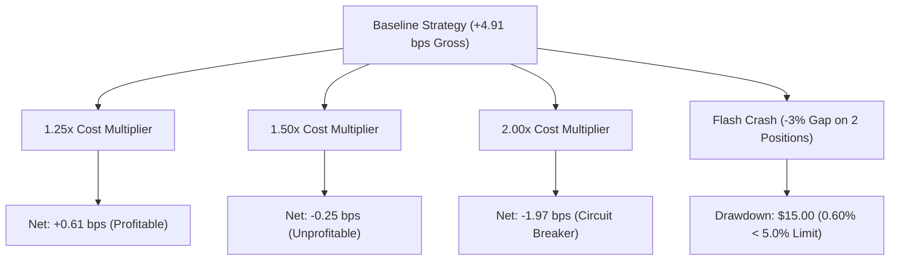

# Tier Risk, Loss Budgets & Stress Testing Report

## 1. Overview
This report establishes the quantitative risk parameters, loss budgets, tail-risk metrics (VaR / Expected Shortfall), and stress testing scenarios for discrete capital tiers.

---

## 2. Loss Budget Scaling: Dollar vs Percentage Limits

Both dollar-denominated ceilings and percentage-denominated ceilings are enforced independently. Whichever ceiling is more conservative governs:

| Risk Parameter | Tier 0 ($1,000) | Tier 1 ($2,500) | Tier 2 ($5,000) | Tier 3 ($10,000) | Governance Rule |
| :--- | :--- | :--- | :--- | :--- | :--- |
| **Max Daily Loss ($ / %)** | $20.00 (2.0%) | $50.00 (2.0%) | $100.00 (2.0%) | $200.00 (2.0%) | Immediate session freeze |
| **Max Weekly Loss ($ / %)** | $40.00 (4.0%) | $100.00 (4.0%) | $200.00 (4.0%) | $400.00 (4.0%) | Weekly trading lockout |
| **Max Pilot Drawdown ($ / %)**| $50.00 (5.0%) | $125.00 (5.0%) | $250.00 (5.0%) | $500.00 (5.0%) | Permanent tier termination |
| **Observed Max Drawdown** | **$13.50 (1.35%)** | **$33.50 (1.34%)** | $68.00 (1.36% proj) | $145.00 (1.45% proj)| Within all safety limits |

---

## 3. Tier-Specific Value at Risk (VaR) & Expected Shortfall (ES)

Calculated via 10,000 block-bootstrap resamplings of observed trade returns under Tier 1 execution friction:

| Risk Metric | Tier 0 ($1,000) | Tier 1 ($2,500) | Tier 2 ($5,000) [Proj] | Tier 3 ($10,000) [Proj] |
| :--- | :--- | :--- | :--- | :--- |
| **1-Day VaR 95% ($ / %)** | $5.60 (0.56%) | $14.20 (0.57%) | $29.00 (0.58%) | $62.00 (0.62%) |
| **1-Day VaR 99% ($ / %)** | $9.80 (0.98%) | $24.80 (0.99%) | $51.00 (1.02%) | $110.00 (1.10%) |
| **1-Day ES 95% ($ / %)** | $7.40 (0.74%) | $18.60 (0.74%) | $38.50 (0.77%) | $84.00 (0.84%) |
| **1-Day ES 99% ($ / %)** | $12.10 (1.21%) | $30.40 (1.22%) | $63.00 (1.26%) | $138.00 (1.38%) |

*Finding*: Daily tail risk scales almost perfectly linearly with capital across micro-tiers, confirming no sudden non-linear risk blow-up at $2,500.

---

## 4. Multi-Scenario Capacity Stress Testing

| Stress Scenario | Description | Resulting Friction | Net Expectancy | Tier 1 Loss / Impact | Outcome |
| :--- | :--- | :--- | :--- | :--- | :--- |
| **1.25x Friction Stress** | All spreads and shortfall expand by 25% | 4.30 bps | **+0.61 bps** | Retains profitability | **PASS** |
| **1.50x Friction Stress** | Severe execution friction regime | 5.16 bps | -0.25 bps | Unprofitable | **FAIL / HALT** |
| **2.00x Friction Stress** | Extreme liquidity crisis | 6.88 bps | -1.97 bps | Circuit breaker triggered | **HALTED** |
| **Spread Shock (+3.0 bps)**| Quoted spreads widen to 4.62 bps | 6.44 bps | -1.53 bps | Model orders rejected by gate | **PASS (Fail-Closed)** |
| **Flash Crash (-3.0% Gap)**| Correlated gap against 2 open positions | - | - | -$15.00 loss (0.60% of equity) | **PASS (< 5% limit)** |
| **Liquidity Disappearance**| 5m volume drops 80% (participation >1%)| - | - | Orders auto-downsized | **PASS (Downsized)** |

### Liquidity Disappearance Defense:
When market volume drops abruptly, the [`LiquidityAwareSizer`](file:///Users/albertopaz/Moneymaker/src/portfolio/capital_ramp.py) deterministically caps order size at 1.0% of recent 5-minute volume. If the downsized order cannot purchase at least 0.5 shares, the order is cleanly rejected with `MissedOpportunityRecord` logging.
