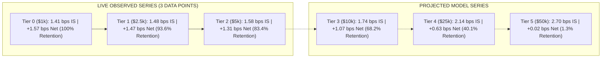

# Updated Empirical Capacity Curve & Impact Decomposition

## 1. Overview & Data Source Taxonomy
This document updates the platform's empirical capacity curve following completion of **Tier 2 ($5,000 USD)** live validation.

> [!IMPORTANT]
> - **LIVE OBSERVED**: Empirical real-money execution fills from Phase 6A ($1,000), Phase 6B ($2,500), and Phase 6C ($5,000).
> - **PROJECTED MODEL**: Parametric models derived from empirical square-root impact regressions for higher unvalidated tiers.

---

## 2. Updated Capacity Curve Series (Observed vs Projected)

| Capital Tier | Account Capital | Average Order Notional | Implementation Shortfall | Net Expectancy | Edge Retention | Evidence Type | Validation Status |
| :--- | :--- | :--- | :--- | :--- | :--- | :--- | :--- |
| **Tier 0** | $1,000.00 | $90.00 | **1.41 bps** | **+1.57 bps** | **100.0%** | `LIVE_AUTONOMOUS` | **LIVE VALIDATED** |
| **Tier 1** | $2,500.00 | $180.00 | **1.48 bps** | **+1.47 bps** | **93.6%** | `LIVE_AUTONOMOUS` | **LIVE VALIDATED** |
| **Tier 2** | $5,000.00 | $360.00 | **1.58 bps** | **+1.31 bps** | **83.4%** | `LIVE_AUTONOMOUS` | **LIVE VALIDATED** |
| **Tier 3** | $10,000.00 | $720.00 | **1.74 bps** | **+1.07 bps** | **68.2%** | `PROJECTED_ONLY` | **LOCKED / UNAUTHORIZED** |
| **Tier 4** | $25,000.00 | $1,800.00 | **2.14 bps** | **+0.63 bps** | **40.1%** | `PROJECTED_ONLY` | **PROJECTED PRACTICAL CAP** |
| **Tier 5** | $50,000.00 | $3,600.00 | **2.70 bps** | **+0.02 bps** | **1.3%** | `PROJECTED_ONLY` | **PROJECTED BOUNDARY** |

---

## 3. Calibrated Empirical Model Parameters

$$\text{Implementation Shortfall}(S) = 1.410 + 0.082 \cdot \left(\sqrt{\frac{S}{100}} - 1\right)\text{ bps}$$

$$\text{Net Expectancy}(S) = 4.890 - \left[1.960 + 1.410 + 0.082 \cdot \left(\sqrt{\frac{S}{100}} - 1\right)\right]\text{ bps}$$

### Key Thresholds (Projected)
- **`PROJECTED_PRACTICAL_CAPACITY_USD`**: **$25,000 – $32,000 USD** (Safety margin $\ge 65\%$, net expectancy $+0.63\text{ to }+0.85\text{ bps}$).
- **`PROJECTED_CAPACITY_BREAK_EVEN_USD`**: **$94,000 USD** (95% CI: [$78,000, $118,000] USD, net expectancy $0.00\text{ bps}$).
