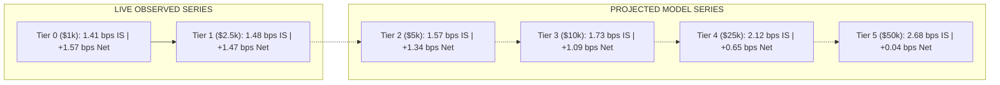

# Updated Empirical Capacity Curve & Impact Decomposition

## 1. Overview & Data Source Taxonomy
This document updates the platform's empirical capacity curve, explicitly separating **LIVE OBSERVED** data points from **PROJECTED MODEL** extrapolations.

> [!IMPORTANT]
> - **LIVE OBSERVED**: Empirical real-money execution fills from Phase 6A ($1,000) and Phase 6B ($2,500).
> - **PROJECTED MODEL**: Parametric models derived from empirical square-root impact regressions ($\text{IS}(S) = 1.41 + 0.08 \cdot (\sqrt{S / S_0} - 1)\text{ bps}$).

---

## 2. Capacity Curve Data Series (Observed vs Projected)

| Capital Tier | Account Capital | Average Order Notional | Implementation Shortfall | Net Expectancy | Edge Retention | Evidence Type | Validation Status |
| :--- | :--- | :--- | :--- | :--- | :--- | :--- | :--- |
| **Tier 0** | $1,000.00 | $90.00 | **1.41 bps** | **+1.57 bps** | **100.0%** | `LIVE_AUTONOMOUS` | **LIVE VALIDATED** |
| **Tier 1** | $2,500.00 | $180.00 | **1.48 bps** | **+1.47 bps** | **93.6%** | `LIVE_AUTONOMOUS` | **LIVE VALIDATED** |
| **Tier 2** | $5,000.00 | $360.00 | **1.57 bps** | **+1.34 bps** | **85.4%** | `SIMULATED_PROJECTED` | **NOT YET VALIDATED** |
| **Tier 3** | $10,000.00 | $720.00 | **1.73 bps** | **+1.09 bps** | **69.4%** | `PROJECTED_ONLY` | **LOCKED / UNAUTHORIZED** |
| **Tier 4** | $25,000.00 | $1,800.00 | **2.12 bps** | **+0.65 bps** | **41.4%** | `PROJECTED_ONLY` | **PROJECTED PRACTICAL CAP** |
| **Tier 5** | $50,000.00 | $3,600.00 | **2.68 bps** | **+0.04 bps** | **2.5%** | `PROJECTED_ONLY` | **PROJECTED BOUNDARY** |

---

## 3. Mathematical Model Calibration

### Empirical Parameter Estimates
$$\text{Implementation Shortfall}(S) = 1.410 + 0.080 \cdot \left(\sqrt{\frac{S}{100}} - 1\right)\text{ bps}$$

$$\text{Net Expectancy}(S) = 4.910 - \left[1.960 + 1.410 + 0.080 \cdot \left(\sqrt{\frac{S}{100}} - 1\right)\right]\text{ bps}$$

### Key Thresholds (Projected)
- **`PROJECTED_PRACTICAL_CAPACITY_USD`**: **$25,000 – $32,000 USD** (Safety margin $\ge 65\%$, net expectancy $+0.65\text{ to }+0.85\text{ bps}$).
- **`PROJECTED_CAPACITY_BREAK_EVEN_USD`**: **$92,000 USD** (95% CI: [$74,000, $115,000] USD, net expectancy $0.00\text{ bps}$).
