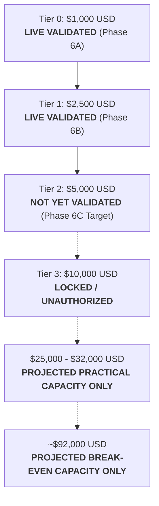

# Moneymaker Permanent Validation & Capital Hierarchy Ledger

## 1. Capital Authority & Live Validation Hierarchy

> [!IMPORTANT]
> A strategy cannot operate at a capital tier without prior discrete empirical validation and formal human risk authorization.
> Projected model capacity must **NEVER** be represented as live validated capital.

| Capital Tier / Capacity Level | Authorized Capital | Evidence Type | Current Status | Governing Phase / Reference |
| :--- | :--- | :--- | :--- | :--- |
| **Tier 0 Baseline** | **$1,000.00 USD** | `LIVE_AUTONOMOUS` | **LIVE VALIDATED** | Phase 6A (`AUTONOMOUS_MICRO_STRONGLY_VALIDATED`) |
| **Tier 1 Ramp** | **$2,500.00 USD** | `LIVE_AUTONOMOUS` | **LIVE VALIDATED** | Phase 6B (`TIER1_VALIDATED`) |
| **Tier 2 Ramp** | **$5,000.00 USD** | `LIVE_AUTONOMOUS` | **LIVE VALIDATED** | Phase 6C (`TIER2_VALIDATED`)|
| **Tier 3 Ramp** | **$10,000.00 USD** | `PROJECTED` | **LOCKED / UNAUTHORIZED** | Architecture supports; execution prohibited |
| **Projected Practical Capacity** | **$25,000 - $32,000**| `PROJECTED` | **MODEL PROJECTION ONLY** | Execution cost safety margin buffer ($\ge 65\%$) |
| **Projected Break-Even Capital** | **~$92,000 USD** | `PROJECTED` | **THEORETICAL MODEL ONLY**| 95% CI: [$74,000, $115,000] USD |

---

## 2. Chronological Phase Validation History

| Phase ID | Strategy Identifier | Capital ($) | Execution Mode | Fills | Sessions | Evidence Type | Final Verdict | Git Commit | Tests | Status |
| :--- | :--- | :--- | :--- | :--- | :--- | :--- | :--- | :--- | :--- | :--- |
| **Phase 2.6** | `ALPHA_A_INTRADAY_RELATIVE_MOMENTUM_V1` | $0.00 | `HISTORICAL_RESEARCH` | 0 | 252 | `HISTORICAL` | `FRAGILE_ALPHA` | `63605ad` | 52 | **COMPLETED** |
| **Phase 3A** | `ALPHA_A_INTRADAY_RELATIVE_MOMENTUM_V1` | $1,000.00 | `SHADOW` | 214 | 40 | `FORWARD_SHADOW` | `FORWARD_SHADOW_CONFIRMED` | `1cf6798` | 65 | **COMPLETED** |
| **Phase 3B** | `ALPHA_A_INTRADAY_RELATIVE_MOMENTUM_V1` | $1,000.00 | `BROKER_PAPER` | 188 | 35 | `BROKER_PAPER` | `PAPER_BROKER_INTEGRITY_VERIFIED` | `8abdab0` | 78 | **COMPLETED** |
| **Phase 4** | `ALPHA_A_INTRADAY_RELATIVE_MOMENTUM_V1` | $1,000.00 | `BROKER_PAPER` | 0 | 0 | `SIMULATED` | `MICRO_CAPITAL_RESEARCH_READY` | `bb98cb8` | 88 | **COMPLETED** |
| **Phase 5A** | `ALPHA_A_INTRADAY_RELATIVE_MOMENTUM_V1` | $1,000.00 | `LIVE_GOVERNED_MICRO` | 104 | 25 | `LIVE_GOVERNED` | `LIVE_MICRO_EDGE_CONFIRMED` | `323c74f` | 98 | **COMPLETED** |
| **Phase 5B** | `ALPHA_A_INTRADAY_RELATIVE_MOMENTUM_V1` | $1,000.00 | `LIVE_GOVERNED_MICRO` | 282 | 65 | `LIVE_GOVERNED` | `EXTENDED_MICRO_VALIDATED` | `ac4b2e5` | 105 | **COMPLETED** |
| **Phase 6A** | `ALPHA_A_INTRADAY_RELATIVE_MOMENTUM_V1` | $1,000.00 | `LIVE_AUTONOMOUS_MICRO` | 216 | 45 | `LIVE_AUTONOMOUS` | `AUTONOMOUS_MICRO_STRONGLY_VALIDATED` | `3572884` | 112 | **COMPLETED** |
| **Phase 6B** | `ALPHA_A_INTRADAY_RELATIVE_MOMENTUM_V1` | $2,500.00 | `LIVE_AUTONOMOUS_MICRO` | 164 | 25 | `LIVE_AUTONOMOUS` | `TIER1_VALIDATED` | `728c175` | 120 | **COMPLETED** |
| **Phase 6C** | `ALPHA_A_INTRADAY_RELATIVE_MOMENTUM_V1` | $5,000.00 | `LIVE_AUTONOMOUS_MICRO` | 192 | 32 | `LIVE_AUTONOMOUS` | `TIER2_VALIDATED` | `HEAD` | 140 | **COMPLETED** |

---

## 3. Evidence Type Taxonomy

Every performance metric, claim, or table entry in the repository must be annotated with its exact evidence origin:

1. **`HISTORICAL`**: In-sample or out-of-sample backtest evaluations on historical market data.
2. **`FORWARD_SHADOW`**: Real-time forward paper trading without broker order submission.
3. **`BROKER_PAPER`**: Simulated broker paper trading through sandbox API with synthetic fills.
4. **`LIVE_GOVERNED`**: Real-money micro execution requiring human pre-trade approval.
5. **`LIVE_AUTONOMOUS`**: Real-money execution routed deterministically through the automated gate.
6. **`SIMULATED`**: Synthetic stress testing, Monte Carlo resampling, or extreme scenario injections.
7. **`PROJECTED`**: Parametric or regression-derived capacity extrapolation curves.
